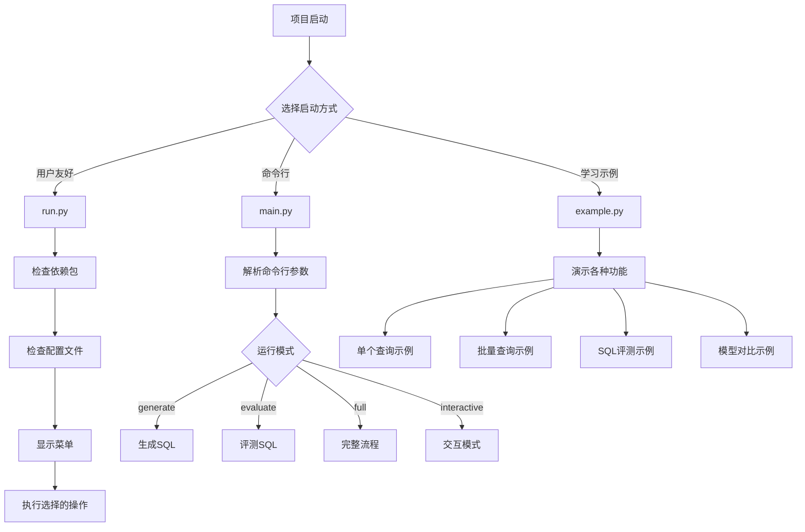

# SQL Copilot 项目流程图

## 🎯 项目整体架构图

## 🔧 核心模块流程图

## 🚀 主要业务流程

### 1. 项目启动流程

### 2. SQL生成流程

### 3. SQL评测流程

### 4. 交互式模式流程

## 📊 数据流图

## 🔄 模块依赖关系图

## 🎯 关键决策点

## 📈 性能优化流程

## 🛠️ 错误处理流程

## 📋 总结

SQL Copilot项目采用了模块化设计，主要包含以下核心组件：

1. **配置管理** (config.py) - 统一管理所有配置信息
2. **SQL生成** (sql_generator.py) - 支持多种LLM模型的SQL生成
3. **SQL评测** (sql_evaluator.py) - 执行SQL并评测结果
4. **工具函数** (utils.py) - 提供通用功能支持
5. **主程序** (main.py) - 命令行接口
6. **启动脚本** (run.py) - 用户友好的菜单界面
7. **示例程序** (example.py) - 功能演示

项目支持多种使用方式，具有良好的扩展性和维护性，能够适应不同的业务场景需求。
